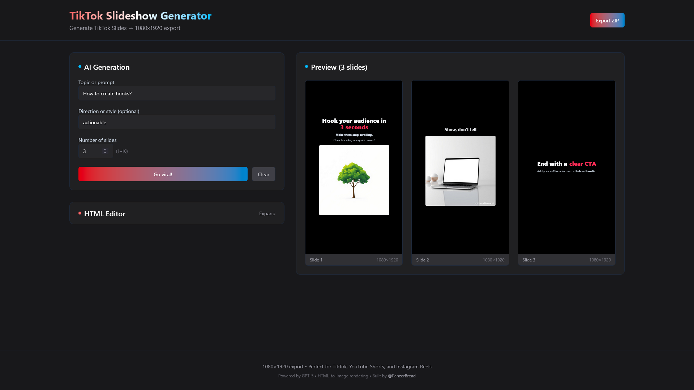
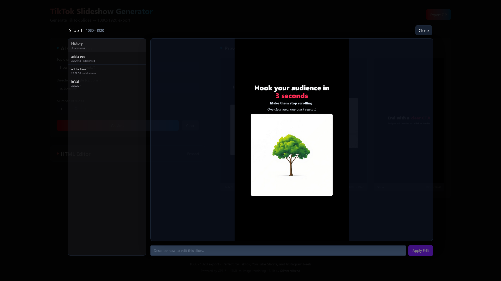

### TikTok Slideshow Generator

Generate and iterate vertical TikTok slideshow slides (1080×1920) with AI. Export crisp PNGs as a ZIP.

### Screenshots





### Features

- AI generate slides from a topic and optional direction/style
- One primary CTA that generates first, then improves existing slides
- Slide-level editing with image context and version history
- HTML editor (collapsible by default)
- 1080×1920 PNG export as a ZIP

### Stack

- Next.js App Router (React 19, Server + Client components)
- TypeScript, Tailwind CSS v4, shadcn components (Radix UI under the hood)
- Sonner toasts

### Prerequisites

- Node.js 20+
- pnpm 9+
- An OpenRouter API key

Create `.env.local` in the project root:

```bash
OPENROUTER_API_KEY=your_api_key_here
```

### Install & Run

```bash
pnpm install
pnpm dev
# build: pnpm build
# start (prod): pnpm start
```

Visit `http://localhost:3000`.

### Usage

- Enter a topic and optional direction, choose slide count, then click the primary CTA
- First run shows “Go viral!” and generates slides; subsequent clicks improve the current slides
- Click a slide to open the modal, type an edit instruction, press Enter (or click Apply) to update
- Export ZIP to download all slides as 1080×1920 PNGs

### API Endpoints

- `POST /api/generate`: creates slides. Returns `{ html }` where slides are separated with `---`
- `POST /api/improve`: improves slides (optionally with captured inline image previews)
- `POST /api/edit-slide`: edits a single slide with instruction and optional images
- `POST /api/image`: generates an image for `<div class="ai-image" data-prompt ...>` placeholders

All responses are sanitized on the server. Prompts enforce vertical portrait and allow inline styles only if explicitly requested by the user.

### Project Structure

- `app/page.tsx`: UI, preview grid, modal editor, export
- `app/api/*`: server routes for generate, improve, edit-slide, image
- `components/SlideRenderer.tsx`: sandboxed iframe renderer and PNG capture

### License

MIT
